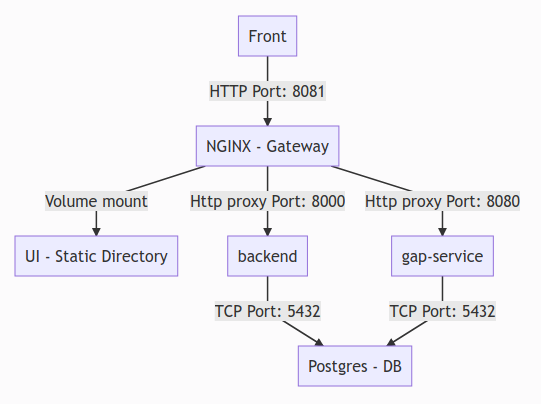
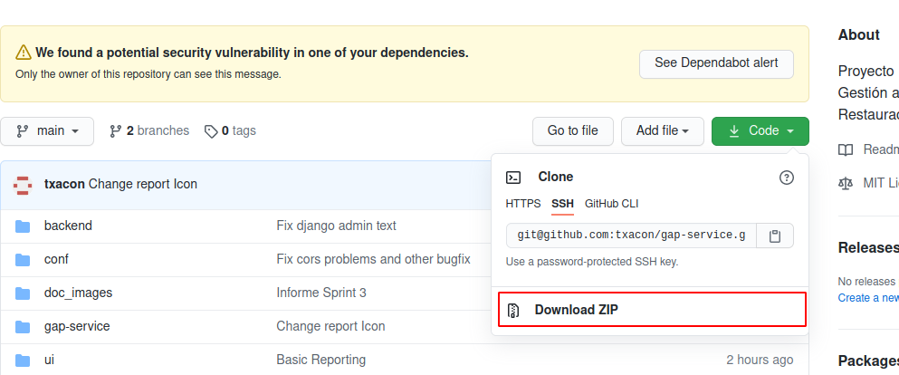

# GAP PROYECT

## Contenido del repositorio

- `backend`: Backend realizando en Django con la capacidad de realizar exportación de tablas en distintos formatos. 
- `gap-service`: Backend del proyecto GAP.
- `ui`: Interfaz de usuario.
- `conf`: Ficheros de configuración auxiliares para el entorno.
- `docker-compose.yml`: Orquestador con todo lo necesario para desplegar el proyecto en un entorno Docker. 

## Arquitectura

El proyecto tiene una arquitectura multiservicio, se ha intentado seguir el principio de responsabilidad única aunque los servicios según vayan creciendo se pueden seguir particionando.

La arquitectura actual de proyecto es la siguiente:



## Prerequisitos

### Disponibilidad de puertos

Es necesario tener disponible el puerto 8081, como puerto de acceso a la aplicación y el puerto 5432 como puerto de acceso local a la db.

Si esto puertos se encuentran ocupados, la aplicación no desplegará.

### Docker

Para mantener las cosas simples, todos los componentes se ejecutarán usando [Docker](https://www.docker.com). **Docker** es una tecnología de contenedores que permite aislar diferentes componentes en sus respectivos entornos.

- Para instalar Docker en Windows siga las instrucciones [aquí](https://docs.docker.com/docker-for-windows/)
- Para instalar Docker en Mac siga las instrucciones [aquí](https://docs.docker.com/docker-for-mac/)
- Para instalar Docker en Linux siga las instrucciones [aquí](https://docs.docker.com/install/)

## Docker Compose

**Docker Compose** es una herramienta para definir y ejecutar aplicaciones Docker multi-contenedor.

Se utiliza el [archivo YAML](docker-compose.yml) para configurar los servicios requeridos para la aplicación. Esto significa que todos los servicios de los contenedores pueden ser lanzados en un solo comando.

Docker Compose se instala de forma predeterminada como parte de Docker para Windows y Docker para Mac, sin embargo los usuarios de Linux tendrá que seguir las instrucciones que se encuentran [aquí](https://docs.docker.com/compose/install/)

Puede comprobar sus versiones actuales de **Docker** y **Docker Compose** usando los siguientes comandos:

```console
docker-compose -v
docker version
```
## Maven (Opcional)


Es una herramienta de software que sirve para construcción y gestión de proyectos java, creado en el año 2002. Es un estándar en la construcción de los proyectos java. Uno de los beneficios es la compilación de proyectos para estructurarlos de forma ordenada por medio de un archivo en formato xml llamado pom.xml.

### Instalación

#### Windows

Descargar maven desde la página oficial: [a link](https://maven.apache.org/download.cgi)

* Ir a la configuración avanzada del sistema
* Variables de entorno (tener en cuenta si está JAVA_HOME configurado que es la ruta del JDK descomprimido como variable de entorno o sino incluirlo).
* Crear dos variables de entorno M2_HOME y MAVEN_HOME con la ruta de maven de donde se especificó anteriormente.
* luego editar el Path para agregar una nueva referencia %M2_HOME%\bin, Aceptar (reiniciar si es necesario).
* Abrir el CMD y ejecutar el comando **mvn -v** para visualizar la versión.

#### Linux

Verificar si está instalado el JDK antes de proceder, para verificar ejecutar el comando **java -version** en caso que no se reconozca hay que incluirlo.

* ejecutar el comando **sudo apt install maven**, aceptar y continuar.
* ejecutar el comando **mvn -v** para visualizar la versión.

## Lanzar el proyecto.

Una vez que todos los prerequisitos están instalados para lanzar el proyecto basta con seguir los siguientes pasos.

### Clonado del proyecto

Se puede realizar de dos formas:

- Descargar el zip proporcionado por Github.



- Clonar con git (Si se dispone de instalación).

Mediante la instrucción:

```bash
git clone https://github.com/txacon/gap-service.git
```

### Lanzamiento del proyecto.

Una vez clonado nos situamos en el directorio del código fuente y ejecutamos el siguiente comando.

```bash
docker-compose up -d
```

Debemos comenzar a ver la descarga de las imágenes y librerías necesarias, el tiempo dependerá de la conexión de nuestro ordenador, pero no debería pasar de los 10 a 15 minutos la primera vez.

Las veces siguientes el sistema no necesitara descargarse todas la imágenes, con lo que el arranque del sistema será mucho más rápido.

### Revisión del estado de los servicios.

Para visualizar los servicios desplegados podemos utilizar la siguiente orden:

```bash
docker ps
```

Deberíamos ver el siguiente log:

```bash
CONTAINER ID        IMAGE                COMMAND                  CREATED             STATUS              PORTS                    NAMES
311ee2dcc3e7        backend:latest       "python manage.py ru…"   2 minutes ago       Up 2 minutes        0.0.0.0:8000->8000/tcp   backend
f60783bdeab2        nginx:alpine         "/docker-entrypoint.…"   2 minutes ago       Up 2 minutes        0.0.0.0:8081->80/tcp     nginx
db706300cc38        gap_service:latest   "java -jar /opt/gap-…"   2 minutes ago       Up 2 minutes        0.0.0.0:8080->8080/tcp   gap_service
d2a3e3e83d71        postgres:latest      "docker-entrypoint.s…"   2 minutes ago       Up 2 minutes        0.0.0.0:5432->5432/tcp   gap_postgres
```

O bien si queremos ver el uso de los recursos de nuestra computadora, con:

```bash
docker stats
```

Nos mostrará el consumo de recursos de la siguiente manerá:

```bash
CONTAINER ID        NAME                CPU %               MEM USAGE / LIMIT     MEM %               NET I/O             BLOCK I/O           PIDS
311ee2dcc3e7        backend             1.81%               90.15MiB / 15.58GiB   0.57%               9.98kB / 1.71kB     50.9MB / 28.7kB     3
f60783bdeab2        nginx               0.00%               8.102MiB / 15.58GiB   0.05%               6.21kB / 42B        4.23MB / 0B         9
db706300cc38        gap_service         0.15%               752.4MiB / 15.58GiB   4.72%               128kB / 87.8kB      121MB / 0B          39
d2a3e3e83d71        gap_postgres        0.75%               28.17MiB / 15.58GiB   0.18%               113kB / 143kB       57.1MB / 401kB      18
```

Para liberar la consola del comando, pulsar Ctrl+C.

### Revisión de los logs de los servicios.

Para ver los logs en vivo de los distintos servicios, podemos utilizar la siguiente orden:

```bash
docker-compose logs --tail 100 -f backend nginx gap_service gap_postgres
```

Deberíamos ver un salida como esta:

```bash
gap_service        |   ________    _____ __________    _________                  .__
gap_service        |  /  _____/   /  _  \\______   \  /   _____/ ______________  _|__| ____  ____
gap_service        | /   \  ___  /  /_\  \|     ___/  \_____  \_/ __ \_  __ \  \/ /  |/ ___\/ __ \
gap_service        | \    \_\  \/    |    \    |      /        \  ___/|  | \/\   /|  \  \__\  ___/
gap_service        |  \______  /\____|__  /____|     /_______  /\___  >__|    \_/ |__|\___  >___  >
gap_service        |         \/         \/                   \/     \/                    \/    \/
gap_service        | 
gap_service        | By: Antonio Díaz-Maroto Chacón
gap_service        | 
gap_service        | 
gap_service        | 2021-01-02 18:45:56.594  INFO 1 --- [           main] com.txacon.gap.GapServiceApplication     : Starting GapServiceApplication v0.0.1-SNAPSHOT on db706300cc38 with PID 1 (/opt/gap-service/gap-service.jar started by root in /opt/app)
gap_service        | 2021-01-02 18:45:56.606  INFO 1 --- [           main] com.txacon.gap.GapServiceApplication     : The following profiles are active: docker
gap_service        | 2021-01-02 18:45:58.358  INFO 1 --- [           main] .s.d.r.c.RepositoryConfigurationDelegate : Bootstrapping Spring Data JPA repositories in DEFERRED mode.
gap_service        | 2021-01-02 18:45:58.515  INFO 1 --- [           main] .s.d.r.c.RepositoryConfigurationDelegate : Finished Spring Data repository scanning in 146ms. Found 7 JPA repository interfaces.
gap_service        | 2021-01-02 18:45:59.512  INFO 1 --- [           main] o.s.b.w.embedded.tomcat.TomcatWebServer  : Tomcat initialized with port(s): 8080 (http)
gap_service        | 2021-01-02 18:45:59.524  INFO 1 --- [           main] o.apache.catalina.core.StandardService   : Starting service [Tomcat]
gap_service        | 2021-01-02 18:45:59.524  INFO 1 --- [           main] org.apache.catalina.core.StandardEngine  : Starting Servlet engine: [Apache Tomcat/9.0.38]
gap_service        | 2021-01-02 18:45:59.586  INFO 1 --- [           main] o.a.c.c.C.[Tomcat].[localhost].[/]       : Initializing Spring embedded WebApplicationContext
gap_service        | 2021-01-02 18:45:59.586  INFO 1 --- [           main] w.s.c.ServletWebServerApplicationContext : Root WebApplicationContext: initialization completed in 2879 ms
gap_service        | 2021-01-02 18:45:59.815  INFO 1 --- [           main] o.s.s.concurrent.ThreadPoolTaskExecutor  : Initializing ExecutorService 'applicationTaskExecutor'
```

La aplicación vendrá identificada por el prefijo de cada linea.

### Acceso a las distintas partes del sistema.

- Acceso a la interfaz de administración: [Interfaz Admin](http://localhost:8081/admin)
- Acceso a la interfaz web movil: [Interfaz Web Movil](http://localhost:8081/)
- Acceso a la documentación de la API: [Documentación API](http://localhost:8081/gap-service/swagger-ui/)
- Acceso a la db: 
  - Host: localhost
  - Port: 5432
  - Db: gap
  - user: test
  - pass: test

### Acceso a la aplicación

- Cliente normal (Solo acceso a la parte web movil):
  - User: user@test.com
  - Pass: pass

- Cliente admin (Acceso al backend y parte movil)
  - User: admin@test.com
  - Pass: pass

### Sistema de backup y recovery.

- Backup and recovery: [Backup and recovery](BACKUP_AND_RECOVER.md)

## Evolución del proyecto.

- Spring_1: [Spring 1](SPRING_1.md)
- Spring_2: [Spring 2](SPRING_2.md)
- Spring_3: [Spring 3](SPRING_3.md)
- Spring_4: [Spring 4](SPRING_4.md)
- Spring_5: [Spring 5](SPRING_5.md)

## VIDEO DEMOSTRACIÓN DE AVANCE.

Link al video, pinche [aquí](https://drive.google.com/file/d/1yIpxmY1TWkivcjUBjP7G-RZP1_8GTw_0/view?usp=sharing)