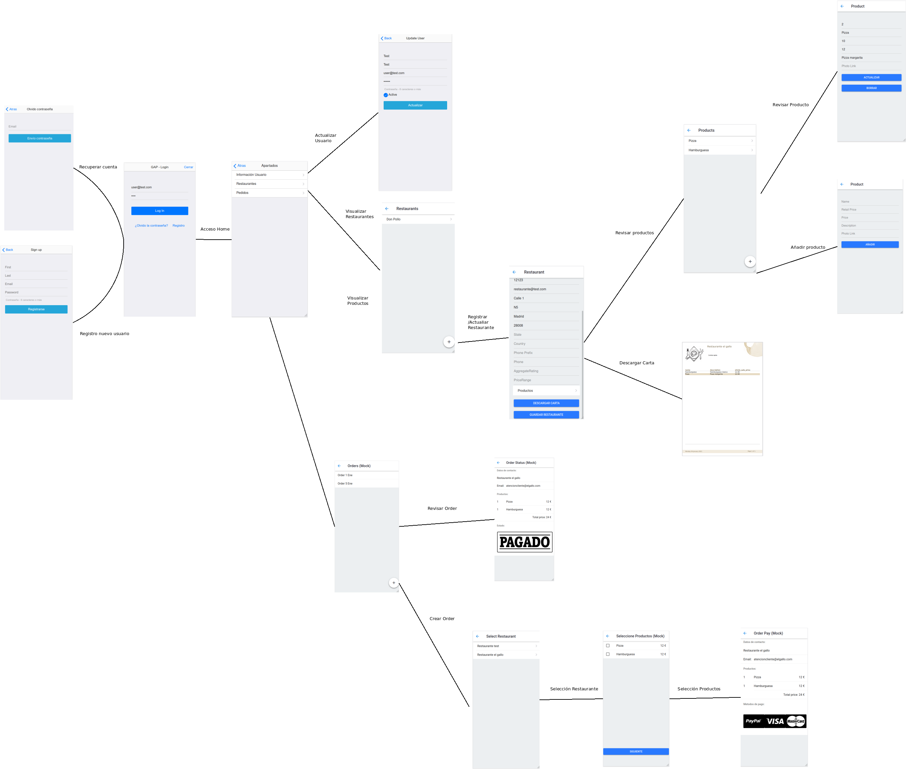
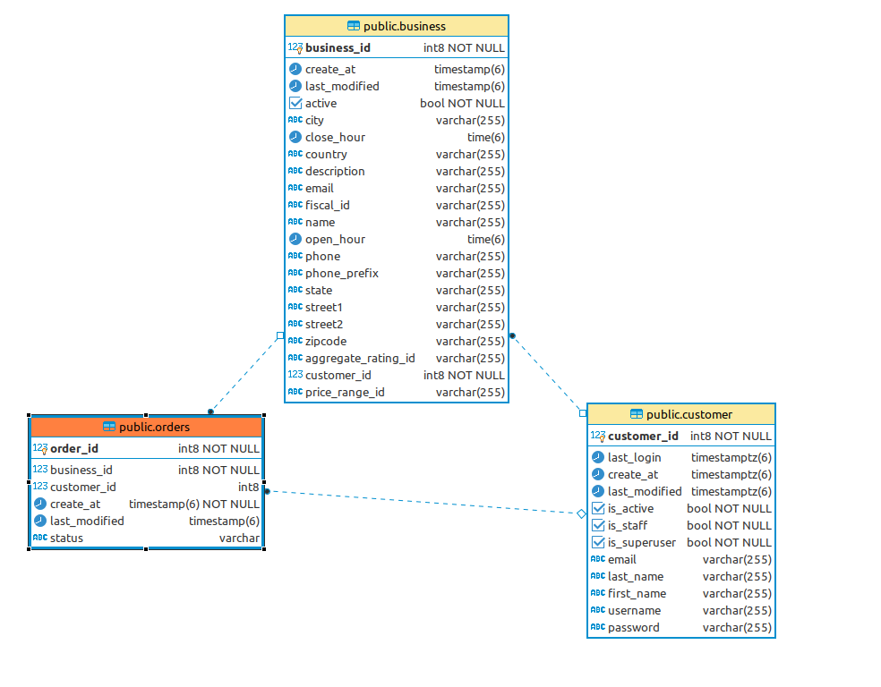
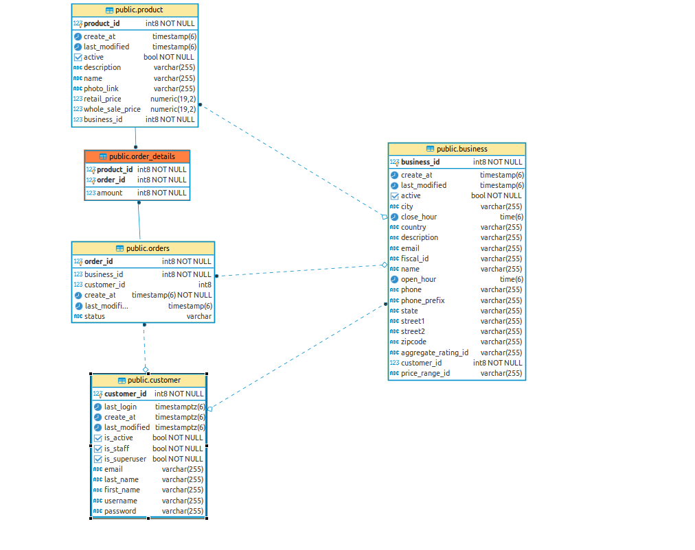
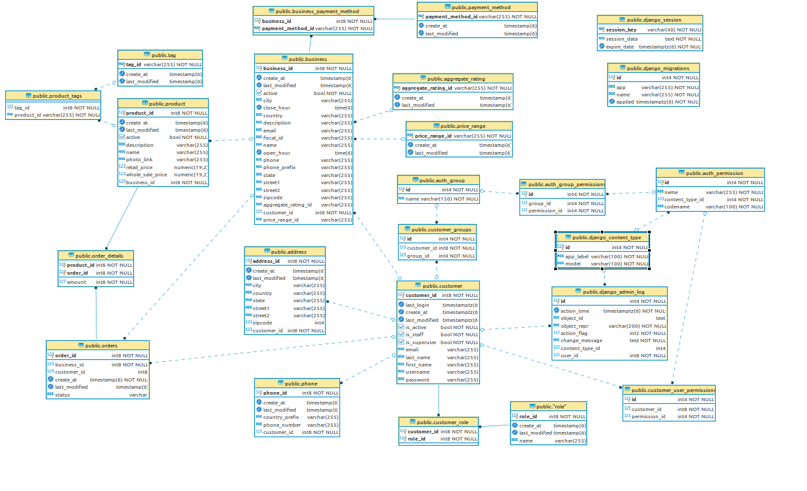

# Spring 4

## User histories

- US_0010: Como propietario de un negocio quiero gestionar los pedidos en curso hacia mi negocio para atenderlos de la mejor forma posible
- US_0011: Como cliente quiero poder visualizar los productos de un negocio para poder realizar pedidos.
- US_0012: Como cliente quiero gestionar mis pedidos para visualizar sus estados y realizar las acciones oportunas en base a los mismos.
- US_0017: Como administrador del sistema quiero tener la posibilidad de restaurar el sistema ante una contingencia, minimizando los daños o riesgos para garantizar la resiliencia del mismo.

# Documentación del backup

Se ha añadido la documentación de backup junto con la estrategía del mismo.

Se peude encontrar en [Documentación de backup](https://github.com/txacon/gap-service/blob/main/BACKUP_AND_RECOVER.md)

# Manual de montaje de la aplicación y actualización con un diagrama de arquitectura.

Se ha añadido la documentación para la puesta en marcha y entendimiento de la arquitectura del proyecto.

Se puede encontrar en [Documentación "Quick Started"](https://github.com/txacon/gap-service/blob/main/README.md)

## Diseño de la interfaz

Para los casos de uso anteriormente mencionados se diseña el siguiente flujo de interfaz.

Se añadido el flujo de revisión y creación de pedidos, desde la selección de restaurante y selección de productos del mismo, hasta la interfaz de pago.

A su vez se pueden revisar los pedidos anteriores.

Se ha refactorizado la interfaz de revisión de productos, ahora parte del restaurante, siendo esto mas adecuado para su revisión y gestión.

Se ha añadido la capacidad de descargar la carta de cada uno de los restaurantes (Siendo el ejemplo de reporting a implementar)

## Diseño de la db

Para dar soporte a las acciones anteriormente descritas, se diseña la siguiente base de datos.

Describimos las relaciones antes de mostrar el diagrama general actualizado. (Este diagrama contiene las relaciones entre el customer, business y el order más adelante veremos la relación al completo)

Las relaciones se describen de la siguiente manera:
 
 - Un Customer puede tener 0..n Orders (Relación muchos a muchos)
 - Un Business puede tener 0..n Orders (Relación muchos a muchos)
  

Las relaciones se describen de la siguiente manera:
 
 - Un order_detail tiene 1 order
 - Un order_detail tiene 1 product
 - Un order_detail tiene 1 amount -> Cantidad de productos.

El sumatorio de las cantidades junto con el precio de salida del producto darán el precio de la factura.

Queda pendiente en el sprint 5 añadir la tabla para guardar el estado de las order junto con el estado del pago.

  
### Digrama general de base de datos

## VIDEO DEMOSTRACIÓN DE AVANCE.

Link al video, pinche [aquí](https://drive.google.com/file/d/1RY7kavPAkYY5wRdlvDaq4OpaZtZphzfe/view?usp=sharing)