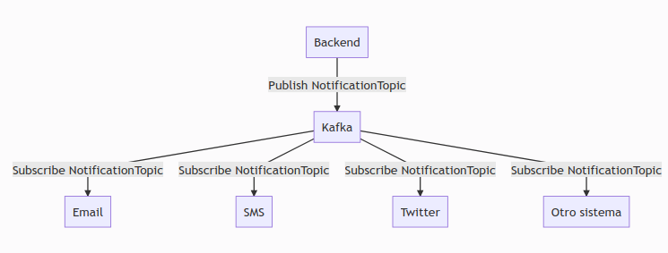

## Sistema de notificaciones

Para el sistema de notificaciones vamos a utilizar un patrón publicador-subscriptor con una cola de mensajes como canal de comunicación.

La elección de esta arquitectura es debido a la naturaleza asincrona de los canales de comunicación ya sean email, sms, o mensajería de cualquier red social.

Además estos sistemas generalmente dependen de un sistema externo, por lo que lograremos el desacoplamiento de nuestro sistema del servicio encargado del envio.

### Colas de mensajes. Apache Kafka.

Las colas de mensajes permiten la comunicación asíncrona, lo que significa que los puntos de conexión que producen y consumen los mensajes interactúan con la cola, no entre sí.

Además, ayudan a simplificar de forma significativa la escritura de código para aplicaciones desacopladas, mejorando el rendimiento, la fiabilidad y la escalabilidad.

### Que es Apache Kafka

Apache Kafka es un sistema de transmisión de datos distribuido con capacidad de escalado horizontal y tolerante a fallos. Gracias a su alto rendimiento nos permite transmitir datos en tiempo real utilizando el patrón de mensajería publish/subscribe.

### Patrón Publish/Subscribe

Es un patrón dentro de la tipología de arquitectura de "Cola de mensajes" utilizado para la comunicación de aplicaciones.

El funcionamiento generico y salvando mucho las distancias funcionaría como una memoria de intercambio de información o un apartado de correos (Es solamente una metáfora, ahora pasaremos a explicarlo).

Existe un elemento "publisher" (productor) que al generar un dato  no lo dirige o referencia específicamente a un "subscriber" (receptor) en concreto, es decir, no lo envía de forma directa a la "dirección" del subscriber.

Para ello se dispone de listas de temas/topics publicados específicos y un conjunto de suscriptores, el productor trata de clasificar el mensaje en base a una tipología, lo pone en la lista de un tema específico y el receptor se suscribe a la listas para recibir ese tipo de mensajes.

Este tipo de comunicación se utiliza sobre todo para la comunicación asíncrona.

Permite diferentes tipos de configuración:
- Tradicional: Cada suscriptor está asociado a uno o varios topic en concreto. Existen muchas variaciones:
  - Cada suscriptor está escuchando 1 topic propio.
  - Cada suscriptor está escuchando X topics independientes.
  - Cada suscriptor está escuchando X topics independientes y Y topics compartido.
- Grupos de consumo: Los suscriptores se pueden agrupar por grupo, este grupo está escuchando un topic y sólo un miembro del grupo tendrá la capacidad de atender el mensaje.
- Radio Difusión: Todos los suscriptores que están escuchando el topic reciben el mensaje (cada suscriptor es responsable de interpretar el mensaje de forma independiente).

### Diagrama de arquitectura del sistema de notificaciones.

Basados en este patrón el diagrama de arquitectura del sistema de notificaciones quedaría de la siguiente manera:

Lo que nos permite esta arquitectura es desacoplar el sistema de backend de la notificaciones, respetando su naturaleza asíncrona y permitiendo escalar a futuro el mismo, sin que haya que tocar el resto del sistema.

### Operaciones del sistema de notificaciones.

El uso del sistema de notificaciones para el sistema GAP esta acotado a los siguientes casos de uso:

- Creación de un pedido
- Modificación de estado
- Cancelación
- Creación de la cuenta de un usuario.
- Cambio de contraseña.
- Cancelación de la cuenta de un usuario.

A continuación presentamos los diagramas de secuencia de los mismo con el fin de representar como interactuá todo el sistema en cada uno de ellos.

#### Creación de un pedido

Para la creación de un pedido, el cliente realiza los pasos de selección de restaurante, selección de productos y pago del mismo.

Una vez realizado el pago. El sistema dispara el sistema de notificaciones con el fin que el cliente tenga un resguardo del mismo y notificar al negocio el nuevo pedido.

En este caso el diagrama representa la notificiación por email, pero la secuencia es análoga para otros canales de comunicación.

#### Modificación de estado

La modificación de un estado, generalmente es disparada por el negocio siguiendo el siguiente diagrama de flujo.

#### Cancelación

#### Creación de la cuenta de un usuario.

#### Cambio de contraseña.

#### Cancelación de la cuenta de un usuario.

